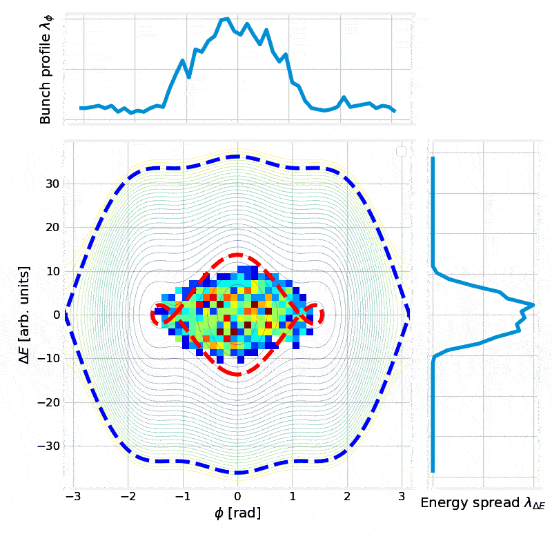

# Multi-Harmonic Particle Tracking

A comprehensive educational tool for simulating longitudinal beam dynamics in multi-harmonic RF systems. This notebook implements particle tracking algorithms based on the theory presented in the Introductory CAS lectures on Longitudinal Beam Dynamics.

**Author:** Anibal Luciano Pastinante (anibalpastinante@gmail.com)  
**Date:** 22/08/2025  
**Acknowledgements:** CAS team and CERN's SY-RF-BR section

---

## 📋 Table of Contents

- [Overview](#overview)
- [Features](#features)
- [Installation](#installation)
- [Quick Start](#quick-start)
- [Theory Background](#theory-background)
- [Core Functions](#core-functions)
- [Classes](#classes)
- [Examples](#examples)
- [Visualization Gallery](#visualization-gallery)
- [Animation Examples](#animation-examples)
- [Parameters Guide](#parameters-guide)
- [Advanced Usage](#advanced-usage)
- [Contributing](#contributing)
- [References](#references)

---

## 🔍 Overview

This notebook provides a complete framework for:
- **Multi-harmonic RF voltage calculations**
- **RF potential computation and visualization**
- **Separatrix calculation and plotting**
- **Particle beam tracking and evolution**
- **Interactive animations with dynamic RF parameter changes**
- **Phase space analysis and trajectory visualization**

The implementation supports both **below-transition** and **above-transition** energy regimes, making it suitable for gaining intuition on various accelerator scenarios.

---

## ✨ Features

### 🧮 Core Physics
- ✅ Multi-harmonic RF voltage synthesis
- ✅ RF potential calculation with numerical integration (without impedance effects)
- ✅ Hamiltonian formulation for phase space dynamics
- ✅ Separatrix computation for arbitrary harmonic combinations
- ✅ Particle tracking with symplectic integration

### 📊 Visualization
- ✅ Interactive separatrix plotting with customizable colors and styles
- ✅ Phase space trajectory visualization
- ✅ RF voltage and potential plotting
- ✅ 2D particle distribution histograms
- ✅ Animated particle evolution with phase/energy histograms

### 🎬 Animation
- ✅ Real-time particle tracking animations
- ✅ Dynamic RF parameter modifications during animation
- ✅ Automatic separatrix updates when parameters change
- ✅ GIF export for presentations and documentation

### 🔧 Flexibility
- ✅ Support for arbitrary number of harmonics
- ✅ Configurable harmonic ratios, phases, and frequencies
- ✅ Both acceleration and deceleration scenarios
- ✅ Customizable initial particle distributions

---

## 🛠️ Installation

### Prerequisites
```bash
pip install numpy matplotlib scipy ipywidgets
```

### Optional Dependencies
For enhanced functionality:
```bash
pip install pillow  # For GIF creation
pip install ffmpeg-python  # For video export
```

### Setup
1. Clone or download the notebook
2. Ensure all dependencies are installed
3. Launch Jupyter Notebook or JupyterLab
4. Open `Multi_Harmonic_Tracking.ipynb`

---

## 🚀 Quick Start

### Basic Multi-Harmonic System Setup
```python
# Define accelerator parameters
energy = 10          # [MeV], [GeV], [TeV]
beta = 0.9           # relativistic velocity factor
charge = 1           # in units of electron charge
V = 2               # RF voltage [V], [kV], [MV]
main_harmonic = 1   # Harmonic number of RF system
eta = -0.01         # 1/γ_transition² - 1/γ²

# Multi-harmonic configuration
r = [1, 0.9, 0.8]                    # Voltage ratios [V₁/V₁, V₂/V₁, V₃/V₁]
h = [1, 2, 3]                        # Harmonic numbers
Phis = [0*np.pi, np.pi, 0*np.pi]     # Phase shifts
dE_s = 0                             # Energy gain per turn

# Create particle beam
particles = generateBunch(bunch_position=0, bunch_length=0.5, 
                         bunch_energy=0, energy_spread=0.5, 
                         n_macroparticles=1000)

particle_beam = ParticleBeam(
    particles=particles, V=V, r=r, h=h, dE_s=dE_s, Phis=Phis,
    below_transition=(eta < 0), constant=abs(main_harmonic * eta / beta**2), 
    E=energy
)
```

### Quick Visualization
```python
# Plot voltage, potential, and separatrices
particle_beam.plot_all()

# Track particles for 1000 turns
particle_beam.advance_x_turns(1000)
particle_beam.plot_state()
```

---

## 📚 Theory Background

### Multi-Harmonic RF Systems

The total RF voltage in a multi-harmonic system is given by:


$V(\phi) = V_1 \sum_{h=1}^{h_n} r_h (\sin {(h\phi + \Phi_{(h)})}$


Where:
- $r_h$ = voltage ratio of harmonic i to fundamental
- $V_1$ = fundamental harmonic voltage
- $h_n$ = harmonic number
- $\Phi_{(h)}$ = phase offset of harmonic i

### RF Potential

The RF potential is computed by integrating the voltage:

$U(\phi) = - \frac{e}{2\pi} \int_{\phi_s}^{\phi} [V(\phi') - V(\phi_s)] d\phi' = - \frac{e}{2\pi} \int_{\phi_s}^{\phi} [V(\phi') - \Delta E_s] d\phi'$

Where:
- $\Delta E_s$ = energy gain per turn of the synchronous particle
- $\phi_s$ = synchronous particle phase (computed solving $\Delta E_s = V(\phi_s)$
- $e$ = particle charge
  
### Hamiltonian Dynamics

The system Hamiltonian is:

$H=\frac{1}{2} \frac{h \eta \omega_0^2}{\beta^2 E}\left(\frac{\Delta E}{\omega_0}\right)^2 + U(\phi)$

Where:
- $\eta$ = phase slip factor ($\eta = \frac{1}{\gamma_T^2} - \frac{1}{\gamma^2}$ where $\gamma_T$ is the transition gamma of the accelerator)
- $\beta$ and $\gamma$ = relativistic factors 
- $E$ = total particle energy (approximated with $E_s$ to not track individual particle energy)
- $\omega_0$ = synchronous particle revolution frequency

### Particle Tracking

The symplectic tracking equations are:


$ \Delta E_{n+1}= \Delta E_n+e  (V(\phi_n) - V(\phi_s)) = \Delta E_n+e V(\phi_n) - \Delta E_s =\Delta E_n+e \sum_{h=1}^{h_n} V_{(h)} (\sin {(h\phi_{n} + \Phi_{(h)})} - \sin{({h\phi_s} + \Phi_{(h)}})$

$ \phi_{n+1}=\phi_n+\frac{2 \pi h_1 \eta}{\beta^2 E} \Delta E_{n+1} $


## 🔧 Core Functions

### RF System Functions
- **`voltage_mh(V, r, h, phi, Phis)`** - Calculate multi-harmonic voltage
- **`potential_mh(V, r, h, phi, dE_s, Phis, below_transition)`** - Compute RF potential
- **`hamiltonian_mh(...)`** - Calculate Hamiltonian values
- **`tracking_function(...)`** - Single-turn particle tracking

### Visualization Functions
- **`separatrices_mh_colored(...)`** - Plot colored separatrices with fill
- **`separatrices_mh_contours(...)`** - Plot separatrices as contour lines
- **`plot_potentials_multi_phi_s(...)`** - Multi-potential plotting
- **`dE_to_phi_s(...)`** - Compute synchronous phase

### Utility Functions
- **`generateBunch(...)`** - Create initial particle distributions
- **`get_ylim_from_separatrices(...)`** - Auto-determine energy limits

---

## 🏗️ Classes

### `ParticleBeam`

Main class for particle beam simulation and visualization.

**Key Methods:**
- `plus_one_turn()` - Advance particles by one turn
- `advance_x_turns(n)` - Advance particles by n turns
- `plot_state()` - Plot current particle distribution
- `plot_trajectory(turns)` - Plot particle trajectories
- `plot_all()` - Comprehensive voltage/potential/separatrix plot
- `modify_RF_system()` - Change RF parameters during simulation

**Example:**
```python
beam = ParticleBeam(particles, V, r, h, dE_s, Phis, below_transition, constant, E)
beam.advance_x_turns(500)
beam.plot_state()
```

### `MultiHarmonicTrackAnimation`

Animation class for creating particle tracking movies.

**Key Methods:**
- `run_animation()` - Create and save animation
- `_animate(i)` - Animation frame function (with RF parameter modification support)

**Example:**
```python
animation = MultiHarmonicTrackAnimation(
    particle_beam, 'Animation', iterations=1000, framerate=30,
    modification=[V*1.1, r, h, new_phases, dE_s], modification_turn=500
)
animation.run_animation()
```

---

## 📖 Examples

### Example 1: Single Harmonic System
```python
# Simple single harmonic
r = [1]
h = [1] 
Phis = [0]
dE_s = 0

beam = ParticleBeam(particles, V=2, r=r, h=h, dE_s=dE_s, Phis=Phis,
                   below_transition=True, constant=0.01, E=10)
beam.plot_all()
```

### Example 2: Dual Harmonic Bunch Shortening
```python
# Bunch shortening with 2nd harmonic
r = [1, 0.5]
h = [1, 2]
Phis = [0, 0]  # In-phase for bunch shortening

beam = ParticleBeam(particles, V=2, r=r, h=h, dE_s=0, Phis=Phis,
                   below_transition=True, constant=0.01, E=10)
beam.advance_x_turns(1000)
beam.plot_state()
```

### Example 3: Triple Harmonic with Phase Animation
```python
# Triple harmonic with phase modification
r = [1, 0.9, 0.8]
h = [1, 2, 3]
Phis = [0, np.pi, 0]

# Create animation with phase change at turn 300
run_multi_harmonic_animation(
    particle_beam=beam,
    figname='Triple Harmonic Evolution',
    iterations=600,
    framerate=30,
    name='triple_harmonic_demo',
    modification=[V, r, h, [0, 0, np.pi], dE_s],  # Change 2nd harmonic phase
    modification_turn=300
)
```

---

## 🖼️ Visualization Gallery

### Separatrix Examples

<!-- Placeholder for separatrix images -->

*Single harmonic system showing classic sinusoidal potential and elliptical separatrix*


*Dual harmonic system (2nd harmonic in-phase) creating flattened potential for bunch shortening*


*Dual harmonic system (2nd harmonic out-of-phase) creating peaked potential for bunch lengthening*


*Triple harmonic system showing complex multi-well potential structure*

### Potential Well Variations


*Comparison of RF voltage waveforms for different harmonic combinations*


*Evolution of RF potential shape with varying harmonic ratios*

---

## 🎬 Animation Examples

### Basic Particle Evolution

<!-- Placeholder for animation GIFs -->

*1000 particles evolving in a single harmonic RF system over 500 turns*

### Bunch Shortening Animation


*Demonstration of bunch shortening using 2nd harmonic in-phase*

### Dynamic RF Parameter Changes


*Animation showing particles adapting to RF parameter changes mid-simulation*

### Multi-Well Dynamics


*Complex particle dynamics in multi-harmonic system with multiple potential wells*

### Below vs Above Transition


*Side-by-side comparison of particle behavior below and above transition energy*

---

## 📐 Parameters Guide

### Essential Parameters

| Parameter | Symbol | Description | Units | Typical Range |
|-----------|---------|-------------|-------|---------------|
| `V` | V₁ | Fundamental RF voltage | V, kV, MV | 0.1 - 100 |
| `r` | rᵢ | Harmonic voltage ratios | - | 0 - 1 |
| `h` | hᵢ | Harmonic numbers | - | 1, 2, 3, ... |
| `Phis` | Φᵢ | Phase offsets | rad | 0 - 2π |
| `dE_s` | ΔE_s | Energy gain per turn | Same as E | -E to +E |
| `eta` | η | Phase slip factor | - | ±0.001 - ±0.1 |
| `beta` | β | Relativistic velocity | - | 0.1 - 0.999 |
| `energy` | E | Particle energy | MeV, GeV, TeV | 1 - 10⁶ |

### Advanced Parameters

| Parameter | Description | Default | Notes |
|-----------|-------------|---------|-------|
| `n_phi` | Phase grid points | 2000 | Higher = smoother separatrices |
| `n_delta` | Energy grid points | 400 | Higher = finer energy resolution |
| `phi_margin_percent` | Phase range margin | 20% | For edge effect handling |
| `outer_fill_alpha` | Separatrix fill transparency | 0.2 | 0 = transparent, 1 = opaque |
| `inner_alpha` | Inner separatrix transparency | 0.35 | For multiple separatrices |

---

## 🔬 Advanced Usage

### Custom Initial Distributions

```python
# Gaussian distribution
phases = np.random.normal(0, 0.3, 1000)
energies = np.random.normal(0, 0.2, 1000)
particles = np.vstack([phases, energies])

# Uniform distribution in phase space area
from scipy.stats import multivariate_normal
mean = [0, 0]
cov = [[0.1, 0.05], [0.05, 0.1]]
particles = multivariate_normal.rvs(mean, cov, 1000).T
```

### Multi-Stage RF Programs

```python
# Define RF program stages
stages = [
    {'turns': 0, 'V': 1.0, 'r': [1, 0.5], 'Phis': [0, 0]},
    {'turns': 200, 'V': 1.5, 'r': [1, 0.8], 'Phis': [0, np.pi/4]},
    {'turns': 400, 'V': 2.0, 'r': [1, 1.0], 'Phis': [0, np.pi/2]},
]

# Apply stages during tracking
for i, stage in enumerate(stages[1:], 1):
    beam.advance_x_turns(stage['turns'] - stages[i-1]['turns'])
    beam.modify_RF_system(stage['V'], stage['r'], h, stage['Phis'], dE_s)
    beam.plot_state()
```

### Batch Processing and Analysis

```python
# Parameter scan
voltage_ratios = np.linspace(0, 1, 11)
results = []

for ratio in voltage_ratios:
    r_scan = [1, ratio]
    beam_scan = ParticleBeam(particles.copy(), V, r_scan, [1,2], 0, [0,0], 
                            below_transition, constant, energy)
    beam_scan.advance_x_turns(500)
    
    # Analyze final distribution
    phase_rms = np.std(beam_scan.state[-1][0])
    energy_rms = np.std(beam_scan.state[-1][1])
    results.append({'ratio': ratio, 'phase_rms': phase_rms, 'energy_rms': energy_rms})

# Plot results
import pandas as pd
df = pd.DataFrame(results)
df.plot(x='ratio', y=['phase_rms', 'energy_rms'])
```

---

## 🤝 Contributing

We welcome contributions! Areas where help is needed:

### 🐛 Bug Reports
- Report issues with specific parameter combinations
- Numerical stability problems
- Animation rendering issues

### 💡 Feature Requests
- Additional RF waveform types (sawtooth, square wave)
- 3D visualization capabilities
- Integration with accelerator design codes

### 📝 Documentation
- More physics background explanations
- Additional example notebooks
- Tutorial videos

### 🔧 Code Improvements
- Performance optimization
- Code refactoring
- Test suite development

**How to Contribute:**
1. Fork the repository
2. Create a feature branch
3. Make your changes
4. Add tests and documentation
5. Submit a pull request

---

## 📚 References

### Academic References
1. **CAS - CERN Accelerator School**: "Introductory Course on Accelerator Physics" - Longitudinal Beam Dynamics lectures
2. **H. Wiedemann**: "Particle Accelerator Physics", 4th Edition, Springer (2015)
3. **S.Y. Lee**: "Accelerator Physics", 3rd Edition, World Scientific (2012)
4. **K. Wille**: "The Physics of Particle Accelerators", Oxford University Press (2000)

### Technical Documentation
- **CERN SY-RF-BR Section**: RF system documentation and beam dynamics studies
- **CERN CAS**: Course materials and simulation examples
- **PyAccelerator**: Python accelerator physics library documentation

### Related Software
- **MAD-X**: Methodical Accelerator Design - CERN
- **Elegant**: Accelerator simulation code - ANL
- **BMAD**: Relativistic charged particle simulation library - Cornell
- **PyORBIT**: Space charge simulation toolkit

---

## 📄 License

This educational software is provided under the MIT License. See `LICENSE` file for details.

---

## 📞 Contact

**Author:** Anibal Luciano Pastinante  
**Email:** anibalpastinante@gmail.com  
**Institution:** CERN - European Organization for Nuclear Research

For questions, suggestions, or collaboration opportunities, please don't hesitate to reach out!

---

*This notebook is part of the educational materials developed for the CERN Accelerator School and is intended for educational and research purposes.*
